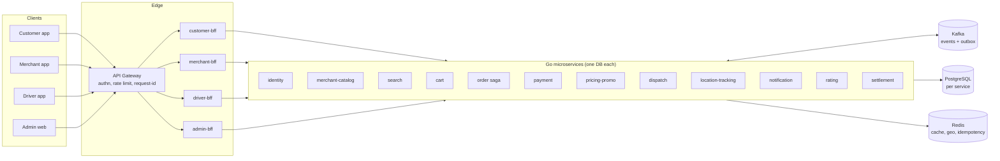

# Shop — Food-Delivery Platform Blueprint

A production-grade design blueprint for a Grab-style food-delivery platform:
**customers** order food from **merchants**, **drivers** deliver it, ops/admin
run the marketplace. Written so an engineering team (or an AI agent) can copy
this folder into an empty repo and implement the whole system from it.

**Stack (confirmed):** Go microservices · TypeScript (NestJS) BFFs · Kubernetes ·
Kafka · PostgreSQL · Redis · GitOps (Argo CD) · OpenTelemetry.

## The docs

| Doc | Covers |
|---|---|
| [docs/01-architecture.md](docs/01-architecture.md) | Service catalog, BFF layer, event backbone (outbox + saga), scalability, determinism |
| [docs/02-api-design.md](docs/02-api-design.md) | API conventions, error envelope, idempotency protocol, endpoint + event contracts, extensibility |
| [docs/03-testing.md](docs/03-testing.md) | Test pyramid, spawn-the-system tooling, test-data generation, isolation/repeatability, env control |
| [docs/04-operations.md](docs/04-operations.md) | CI/CD pipeline & progressive delivery, observability, standardized cluster-traceable logging |
| [docs/05-scale-100m.md](docs/05-scale-100m.md) | 100M-user scale-up: reconciled decision log (D1–D30), cell topology, capacity model v2, DR, cost, org |
| [TASKS.md](TASKS.md) | Implementation roadmap: 1 ordered setup phase + 37 parallel fullstack slices (45 tasks) with Definition of Done + test criteria |

## System context

## Order lifecycle (the core flow)

`cart → checkout → payment authorized → merchant accepts → driver dispatched →
picked up → delivered → settled` — orchestrated by the `order` service as a
saga with compensation (refund, re-dispatch, cancel) at every step.
The full state machine is in [01-architecture.md](docs/01-architecture.md#order-state-machine).

## Rule → design traceability

Every rule this blueprint was asked to satisfy, and exactly where it is fulfilled:

| # | Rule | Where fulfilled | Mechanism |
|---|---|---|---|
| 1 | Fully rolled out with CI/CD | [04 §1](docs/04-operations.md#1-cicd) | Monorepo pipeline: lint→unit→contract→integration→preview-E2E; GitOps deploy; canary + auto-rollback (Argo Rollouts) |
| 2 | Scalable | [01 §5](docs/01-architecture.md#5-scalability) | Stateless services + HPA, geo/city partitioning, Kafka keyed partitions, read replicas, Redis hot paths, p99 budgets |
| 3 | Observability | [04 §2](docs/04-operations.md#2-observability) | OpenTelemetry everywhere, RED + business metrics, SLOs, dashboards, exemplars |
| 4 | Microservices | [01 §1](docs/01-architecture.md#1-service-catalog) | 12 bounded-context services, one DB each, async via Kafka |
| 5 | Has BFF | [01 §2](docs/01-architecture.md#2-bff-layer) | One BFF per client (customer/merchant/driver/admin); aggregation only, no business logic |
| 6 | Idempotency | [02 §3](docs/02-api-design.md#3-idempotency-protocol) | `Idempotency-Key` header + key store with request-hash & response replay; outbox + consumer inbox dedupe |
| 7 | Deterministic | [01 §6](docs/01-architecture.md#6-determinism) | Explicit order state machine, injected clock/RNG, event-sourced order history for replay |
| 8 | Consistent API design, supports complex features | [02 §1–2, §5](docs/02-api-design.md) | One resource/error/pagination convention; extensibility rules proven on scheduled/group orders & promos |
| 9 | Testable | [03 §1](docs/03-testing.md#1-test-pyramid) | Unit (deterministic), contract (Pact), integration (Testcontainers), E2E |
| 10 | Easy to spawn system for test | [03 §2](docs/03-testing.md#2-spawning-the-system) | `docker compose up` full stack; per-PR ephemeral K8s namespace via ApplicationSets; `make up/seed/test` |
| 11 | Easy to generate test data | [03 §3](docs/03-testing.md#3-test-data-generation) | Factory lib + `seedctl` CLI + declarative YAML scenarios + golden datasets |
| 12 | Controllable env for test | [03 §5](docs/03-testing.md#5-environment-control) | 12-factor config, env overlays, feature flags, fake providers (payment/map simulators) |
| 13 | Test data isolated & repeatable | [03 §4](docs/03-testing.md#4-isolation--repeatability) | `run_id` scoping (rows, schemas, consumer groups), seeded RNG + frozen clock ⇒ identical reruns |
| 14 | Standardized, traceable network logs across cluster | [04 §3](docs/04-operations.md#3-standardized-network-logging) | One JSON log envelope from shared middleware; W3C `traceparent` over HTTP **and** Kafka; edge-minted request-id |
| 15 | Production grade @ 100M users | [05](docs/05-scale-100m.md) + [TASKS.md](TASKS.md) | Cell topology, sharded PG + transaction-durable idempotency, telemetry plane, risk + ledger + recon, tiered DR with drills |

## How to use this blueprint

1. Copy `shop/` into an empty repository.
2. Read the four docs in order (architecture → API → testing → operations).
3. Scaffold the monorepo layout from [04 §1.1](docs/04-operations.md#11-monorepo-layout).
4. Implement service-by-service following the catalog; keep the CI gates from
   doc 04 green from day one (the pipeline is part of the system, not an add-on).
5. Treat the traceability table above as the acceptance checklist: the system is
   "done" when every row is demonstrably true in production.
